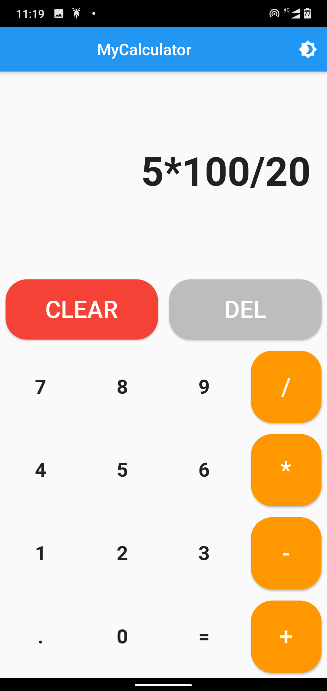
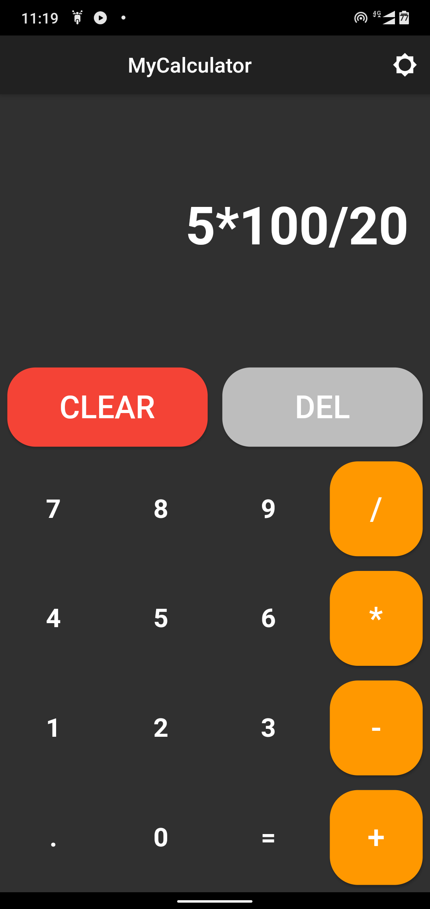
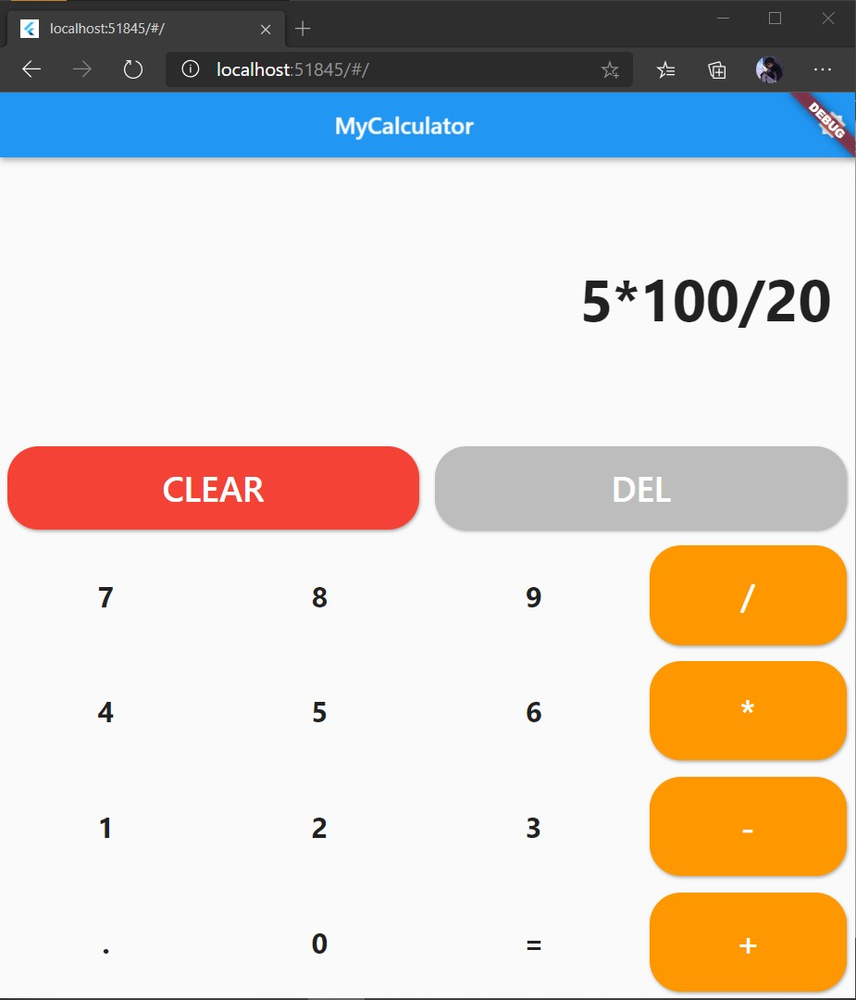
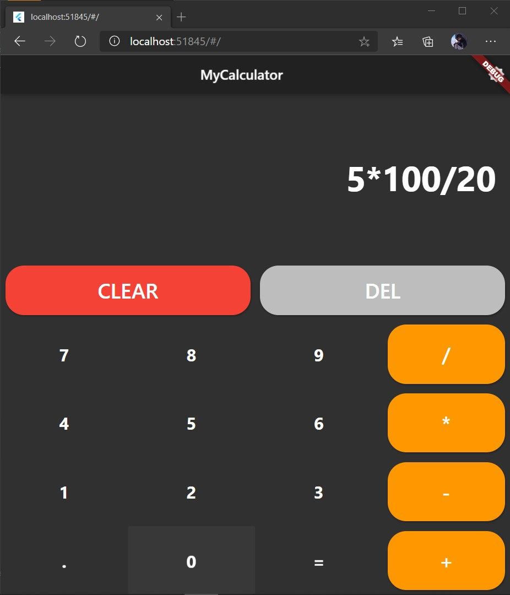

# Calculator app

A normal calculator app with changable theme ( light / dark ) built on flutter

## Features:

1. A simple interface which is pleasing to look at
2. A button on the appbar to change the theme from light to dark and vice versa
3. **Error handling** : This feature will correct your expression if you enter a wrong one as soon as you click on the = button
4. Support for decimal numbers
more yet to come

## ScreenShots: 
### Android:
  
### Web
  

## Packages Used :
**eval_ex** : [eval_ex: ^1.0.10](https://pub.dev/packages/eval_ex)
